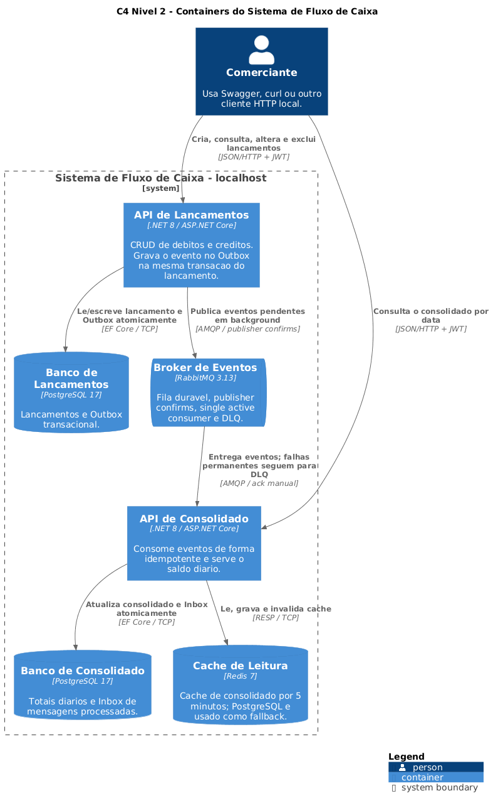

# FluxoCaixa

Solução em C#/.NET 8 para controle de lançamentos financeiros e consulta do saldo diário consolidado. O projeto foi desenhado como dois microsserviços independentes e executa integralmente em `localhost` com Docker Desktop, sem serviços de nuvem, e-mail ou identidade externos.

## Estado verificado

Validação executada em Windows + Docker Desktop em 18/07/2026:

| Verificação | Resultado |
|---|---:|
| Build das APIs em Docker | 0 erros e 0 warnings |
| Testes unitários | 23/23 aprovados |
| Auditoria NuGet | 0 pacotes vulneráveis conhecidos |
| Smoke test HTTP | aprovado |
| Consolidado parado durante um lançamento | lançamento disponível e 0% de perda após recuperação |
| RabbitMQ parado durante um lançamento | suportado por Transactional Outbox |
| Carga no consolidado | 500/500 respostas, 49,86 req/s, 0% de perda |
| Diagramas | 6 fontes PlantUML renderizadas e verificadas |

O relatório reproduzível está em [`docs/relatorio-teste-carga-2026-07-18.md`](docs/relatorio-teste-carga-2026-07-18.md).

## Arquitetura



- **API de Lançamentos (`:5101`)**: CRUD de débitos e créditos, com PostgreSQL próprio.
- **API de Consolidado (`:5102`)**: projeção de leitura do saldo diário, com PostgreSQL próprio e cache Redis.
- **RabbitMQ**: comunicação assíncrona; o serviço de lançamentos não chama o consolidado diretamente.
- **Transactional Outbox**: lançamento e evento são persistidos na mesma transação. Se o broker cair, a requisição continua disponível e o publicador tenta novamente.
- **Idempotent Inbox**: o consolidado registra cada `MessageId` na mesma transação do saldo, evitando dupla contabilização em redelivery.
- **DLQ**: mensagens inválidas são rejeitadas para `fluxocaixa.consolidado.dlq`, sem loop infinito.
- **Cache-aside**: Redis usa TTL de 5 minutos; se estiver indisponível, a leitura continua no PostgreSQL.

A consistência entre os serviços é **eventual**. Um `POST`, `PUT` ou `DELETE` pode levar alguns instantes para aparecer no consolidado.

## Pré-requisitos

- Docker Desktop com Docker Compose.
- PowerShell 5.1 ou superior para os scripts de validação.
- .NET 8 SDK apenas para executar testes fora dos containers.

Nenhum Java é necessário. A renderização PlantUML também ocorre em um container Docker.

## Início rápido

No PowerShell, dentro da raiz do repositório:

```powershell
docker compose up -d --build
docker compose ps
```

### Isolamento Docker

O arquivo Compose fixa o projeto como `carrefour-fluxocaixa-prova`. Assim, mesmo sem informar `-p`, todos os recursos recebem um namespace exclusivo:

- containers: `carrefour-fluxocaixa-prova-*`;
- rede privada: `carrefour-fluxocaixa-prova_fluxocaixa-network`;
- volumes: `carrefour-fluxocaixa-prova_postgres_*`, `carrefour-fluxocaixa-prova_rabbitmq_data` e `carrefour-fluxocaixa-prova_redis_data`.

Nenhuma rede ou volume é declarado como `external`. Os comandos `down` e `down -v` atuam apenas nesse ambiente da prova e não alteram containers de outros projetos.

A rede bridge é dedicada ao projeto e não é compartilhada com outros ambientes Docker. Todas as portas publicadas são vinculadas somente a `127.0.0.1`, sem exposição para a rede local da máquina; os containers só ingressariam em outra rede se isso fosse configurado explicitamente.

Serviços locais:

| Serviço | Endereço |
|---|---|
| Swagger Lançamentos | http://localhost:5101/swagger |
| Swagger Consolidado | http://localhost:5102/swagger |
| RabbitMQ Management | http://localhost:15674 (`guest` / `guest`) |
| Liveness Lançamentos | http://localhost:5101/health/live |
| Readiness Lançamentos | http://localhost:5101/health/ready |
| Liveness Consolidado | http://localhost:5102/health/live |
| Readiness Consolidado | http://localhost:5102/health/ready |

O endpoint `/health` mostra todas as dependências, inclusive as degradáveis RabbitMQ/Redis. `/health/ready` representa a capacidade de atender requisições e exige apenas o banco obrigatório.

Para encerrar sem apagar dados:

```powershell
docker compose down
```

Para reiniciar do zero, apagando exclusivamente os volumes deste projeto:

```powershell
docker compose down -v
docker compose up -d --build
```

## Autenticação local

As APIs exigem JWT válido e a role `comerciante`. O token é gerado offline, sem `jwt.io` ou Identity Provider:

```powershell
$token = .\scripts\New-LocalJwt.ps1
$headers = @{ Authorization = "Bearer $token" }
```

A chave default é apenas uma credencial de demonstração local. Ela pode ser substituída antes de subir os containers:

```powershell
$env:JWT_SECRET_KEY = "uma-chave-local-forte-com-pelo-menos-32-bytes"
docker compose up -d --build
$token = .\scripts\New-LocalJwt.ps1 -Secret $env:JWT_SECRET_KEY
```

## Uso da API

Tipos: `1 = Débito`, `2 = Crédito`.

Criar um lançamento:

```powershell
$body = @{
  tipo = 2
  valor = 1500.00
  data = "2026-07-18"
  descricao = "Venda de produtos"
} | ConvertTo-Json

$lancamento = Invoke-RestMethod -Method Post `
  -Uri "http://localhost:5101/api/lancamentos" `
  -Headers $headers -ContentType "application/json" -Body $body
```

Consultar o consolidado:

```powershell
Invoke-RestMethod `
  -Uri "http://localhost:5102/api/consolidado?data=2026-07-18" `
  -Headers $headers
```

Endpoints:

| Método | Rota | Descrição |
|---|---|---|
| `POST` | `/api/lancamentos` | cria débito ou crédito |
| `GET` | `/api/lancamentos?data=yyyy-MM-dd` | lista por data |
| `GET` | `/api/lancamentos/{id}` | consulta por ID |
| `PUT` | `/api/lancamentos/{id}` | altera tipo, valor, data e descrição |
| `DELETE` | `/api/lancamentos/{id}` | exclui lançamento |
| `GET` | `/api/consolidado?data=yyyy-MM-dd` | consulta o saldo diário |

Uma alteração que muda a data do lançamento reverte o total do dia antigo e aplica o valor no dia novo.

## Testes reproduzíveis

```powershell
# Unitários
dotnet test FluxoCaixa.sln --configuration Release

# CRUD e consolidação eventual
.\scripts\Test-Smoke.ps1

# Requisito: lançamentos continuam disponíveis com consolidado parado
.\scripts\Test-Resilience.ps1

# Outbox: lançamentos continuam disponíveis com RabbitMQ parado
.\scripts\Test-Outbox.ps1

# 50 requisições/s por 10 segundos, perda máxima de 5%
.\scripts\Test-Load.ps1 -RequestsPerSecond 50 -DurationSeconds 10

# Pipeline local completo
.\scripts\Test-All.ps1
```

O benchmark local comprova o requisito no ambiente medido, mas não substitui teste de capacidade e soak test no hardware de produção.

## Diagramas C4

| Nível/fluxo | PNG | Fonte |
|---|---|---|
| C4 Nível 1 - Contexto | [`01-contexto.png`](docs/diagrams/01-contexto.png) | [`01-contexto.puml`](docs/diagrams/01-contexto.puml) |
| C4 Nível 2 - Containers | [`02-container.png`](docs/diagrams/02-container.png) | [`02-container.puml`](docs/diagrams/02-container.puml) |
| C4 Nível 3 - Lançamentos | [`03-componentes-lancamentos.png`](docs/diagrams/03-componentes-lancamentos.png) | [`03-componentes-lancamentos.puml`](docs/diagrams/03-componentes-lancamentos.puml) |
| C4 Nível 3 - Consolidado | [`04-componentes-consolidado.png`](docs/diagrams/04-componentes-consolidado.png) | [`04-componentes-consolidado.puml`](docs/diagrams/04-componentes-consolidado.puml) |
| C4 Nível 4 - Código | [`05-codigo.png`](docs/diagrams/05-codigo.png) | [`05-codigo.puml`](docs/diagrams/05-codigo.puml) |
| Fluxo de resiliência | [`06-fluxo-resiliencia.png`](docs/diagrams/06-fluxo-resiliencia.png) | [`06-fluxo-resiliencia.puml`](docs/diagrams/06-fluxo-resiliencia.puml) |

As fontes usam a biblioteca C4 incluída no PlantUML (`<C4/...>`), sem download de includes remotos. Para regenerar todos os PNGs:

```powershell
.\scripts\Render-Diagrams.ps1
```

## Requisitos não funcionais

| Critério | Implementação/evidência |
|---|---|
| Escalabilidade | APIs stateless; leitura com Redis; índices por data; serviços e bancos separados |
| Resiliência | Outbox, publisher confirms, fila durável, reconexão, Inbox, ack manual, DLQ, retries EF Core |
| Disponibilidade | API de lançamentos sem dependência síncrona do consolidado ou broker; restart policy; liveness/readiness |
| Segurança | JWT HS256, validação de issuer/audience/expiração/assinatura e policy da role `comerciante` |
| Desempenho | cache-aside; meta de 50 req/s por 10 s, 49,86 req/s observadas e 0% de perda no teste local |
| Observabilidade | logs estruturados e health checks por dependência |
| Confiabilidade | bancos por serviço; transações locais; idempotência por `MessageId` |
| Supply chain | versões corrigidas, scan NuGet local e verificação no GitHub Actions |

Metas e critérios completos estão em [`docs/REQUISITOS.md`](docs/REQUISITOS.md), e as decisões em [`docs/ADR.md`](docs/ADR.md).

## Trade-offs e limites conscientes

- A separação em dois serviços adiciona operação e consistência eventual, mas atende diretamente ao isolamento exigido pelo desafio.
- `x-single-active-consumer` serializa a escrita do agregado diário e oferece failover entre réplicas. A leitura pode escalar horizontalmente de forma independente.
- Redis melhora desempenho, mas não é fonte da verdade.
- JWT local é adequado à prova offline; produção deve usar OAuth2/OIDC, rotação de chaves e HTTPS.
- O schema usa `EnsureCreated` mais criação idempotente das tabelas auxiliares para facilitar a avaliação. Produção deve usar migrations versionadas.
- Não foram implementados gateway, rate limit, tracing distribuído, dashboards nem CI/CD; estão descritos como evolução, não como funcionalidade existente.

## Publicação no GitHub

O projeto local já pode ser versionado. Para atender ao item obrigatório da prova, crie um repositório público vazio na sua conta e publique:

```powershell
git remote add origin https://github.com/SEU_USUARIO/fluxocaixa.git
git branch -M main
git push -u origin main
```

Não inclua credenciais reais no repositório público. As credenciais presentes são exclusivamente defaults locais de demonstração.
